# 👋 Hi, I'm Ajay Chauhan

  <picture>
    <source media="(prefers-color-scheme: dark)" srcset="./dark.svg">
    <source media="(prefers-color-scheme: light)" srcset="./light.svg">
    
  </picture>

  <strong>Data Analytics & Data Science Student</strong>
   
  Turning Data into Insights, Visualizations & Decisions.

  🎓 <strong>BCA (Data Science & Artificial Intelligence)</strong>
  &nbsp; • &nbsp;
  🏫 <strong>Babu Banarasi Das University, Lucknow</strong>

  📊 <strong>Data Analytics</strong>
  &nbsp; • &nbsp;
  📈 <strong>Business Intelligence</strong>
  &nbsp; • &nbsp;
  📉 <strong>Data Visualization</strong>
  &nbsp; • &nbsp;
  🧠 <strong>Data-Driven Problem Solving</strong>

---

## 🚀 About Me

BCA (Data Science & AI) student focused on transforming **raw data into meaningful insights, dashboards, and actionable information**.

I enjoy working across the complete analytics workflow:

- Data Collection & Preparation
- Data Cleaning & Transformation
- Exploratory Data Analysis
- SQL-Based Data Analysis
- Dashboard Development
- Data Visualization & Reporting
- Business & Academic Insights
- Data-Driven Problem Solving

My goal is to bridge the gap between **raw data and meaningful decisions** through structured analysis and clear visualization.

---

## 🌐 Portfolio

Explore my analytics projects, dashboards, technical skills, and data-driven work.

---

## 🛠️ Technical Skills

### 🐍 Programming & Data Analysis

---

### 📊 Data Analytics & Business Intelligence

---

### 🗄️ Data & Databases

---

### 🖥️ Systems & Development

---

### 🧰 Tools & Productivity

---

## 🔥 Highlighted Projects

## 🎬 Netflix Descriptive Analytics

A practical **Descriptive Analytics project** built with **IBM Cognos Analytics**
using the `netflix_titles.csv` dataset to analyze Netflix content across
countries, genres, release years, ratings, and content types.

**Focus:** `Data Analysis` • `Report Creation` • `Data Visualization` • `Trend Analysis` • `Descriptive Insights`

**Tech:** `IBM Cognos Analytics` `Netflix Dataset` `Descriptive Analytics`

---

## 🏨 Hotel Booking Data Analysis

A hands-on **Data Analytics project** using Python to clean, preprocess, and visualize hotel booking data for understanding booking patterns and customer behavior.

**Focus:** `Data Cleaning` • `EDA` • `Data Visualization` • `Pattern Analysis`

**Tech:** `Python` `Pandas` `Matplotlib`

---

## 🎬 Movie Rating Analysis — Hadoop

A practical **Big Data Analytics project** built with the Hadoop ecosystem to process movie rating data using distributed storage, MapReduce processing, and Hive-based analysis.

**Focus:** `Big Data` • `Distributed Processing` • `Movie Analytics` • `Data Processing`

**Tech:** `HDFS` `MapReduce` `Hive` `Python` `Linux` `Cloudera`

---

## 🗄️ MongoDB & NoSQL Analytics

Hands-on project exploring **MongoDB, NoSQL querying, data manipulation, `$lookup`, and aggregation pipelines** using MongoDB Atlas + Mongosh.

**Focus:** `Querying` • `Aggregation` • `Joins` • `Data Manipulation` • `Nested Data` • `Analytics`

**Tech:** `MongoDB` `Atlas` `Mongosh` `NoSQL`

---

## 🛡️ NEXA-GUARD — AI-Powered Hostel Intelligence

AI-driven platform for **hostel movement verification, safety monitoring,
anomaly detection, and operational intelligence**, developed for the
**Smart India Hackathon (SIH) 2026 Internal Hackathon**.

**Focus:** `Movement Intelligence` • `Geofencing` • `Risk Analysis` • `Anomaly Detection` • `Resource Optimization`

**Tech:** `Node.js` `Express.js` `PostgreSQL` `JavaScript` `Leaflet.js` `Chart.js`

---

### 📍 Campus Service Request Management System *(Hackathon Project)*

🏆 Built during a **University Hackathon**

A structured institutional service-request system for managing operational data across different roles.

**Focus:** `Data Collection` • `Workflow Tracking` • `Status Monitoring` • `Operational Analysis`

**Tech:** `HTML` `CSS` `JavaScript` `Google Apps Script` `Google Sheets`

---

### 📍 Restaurant Website – ADCA Project

A multi-page responsive website developed during the foundational phase of web development.

**Focus:** `Responsive Design` • `Multi-Page Layout` • `Navigation` • `UI Development`

**Tech:** `HTML` `CSS` `JavaScript`

---

## 📈 Academic Performance

- **SGPA 1st Semester:** 8.85
- **SGPA 2nd Semester:** 9.0
- **SGPA 3rd Semester:** 9.14
- **SGPA 3rd Semester:** 8.92
- Currently in **5th Semester**

---

## 🎯 Currently Seeking

- Data Analyst Internships
- Business Intelligence Opportunities
- Data Visualization Projects
- SQL & Power BI Projects
- Data Analytics Collaborations
- Real-World Data Problem Solving

---

## 📊 GitHub Analytics

  

---

---

## 🐍 Contribution Snake

<picture>
  <source
    media="(prefers-color-scheme: dark)"
    srcset="https://raw.githubusercontent.com/ajaychauhanAI/ajaychauhanAI/output/github-snake-dark.svg"
  />
  <source
    media="(prefers-color-scheme: light)"
    srcset="https://raw.githubusercontent.com/ajaychauhanAI/ajaychauhanAI/output/github-snake.svg"
  />
  
</picture>

---

## 📚 Currently Learning

- 📊 Advanced Data Analytics
- 🧮 SQL for Data Analysis
- 📈 Power BI & Interactive Dashboards
- 📗 Advanced Excel for Analytics
- 🐍 Python for Data Analysis
- 🧹 Data Cleaning & Transformation
- 📐 Statistics for Data Science
- 🏗 Data Engineering Fundamentals
- 🧠 Analytical Problem Solving

---

## 🎯 Areas of Interest

- 📊 Data Analytics
- 📈 Business Intelligence
- 📉 Data Visualization
- 🧮 SQL & Database Analytics
- 🐍 Python for Data Analysis
- 📗 Advanced Excel Analytics
- 🧹 Data Cleaning & Transformation
- 🏗 Data Engineering
- 🤖 AI & Prompt Engineering

---

## 🧠 Analytics Workflow

`COLLECT` → `CLEAN` → `TRANSFORM` → `ANALYZE` → `VISUALIZE` → `INSIGHT`

I believe effective analytics is not only about finding numbers —  
it is about understanding **what the data means and how it can support better decisions.**

---

## 📫 Connect With Me

---

## 💡 Data Analytics Philosophy

<b>"Turn raw data into meaningful insights, clear visualizations, and better decisions."</b>

